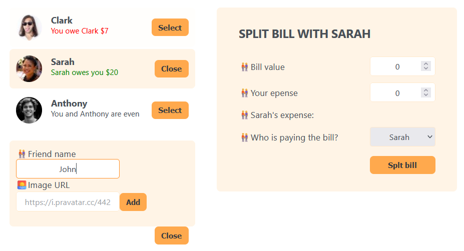

# Eat-N-Split

own solution to Optional Challenge project from Udemy course The "Ultimate React Course 2024: React, Next.js, Redux & More"

## Run React App

- clone repository
- enter eat-n-split project
- run `npm install` in terminal
- run `npm start` in terminal
